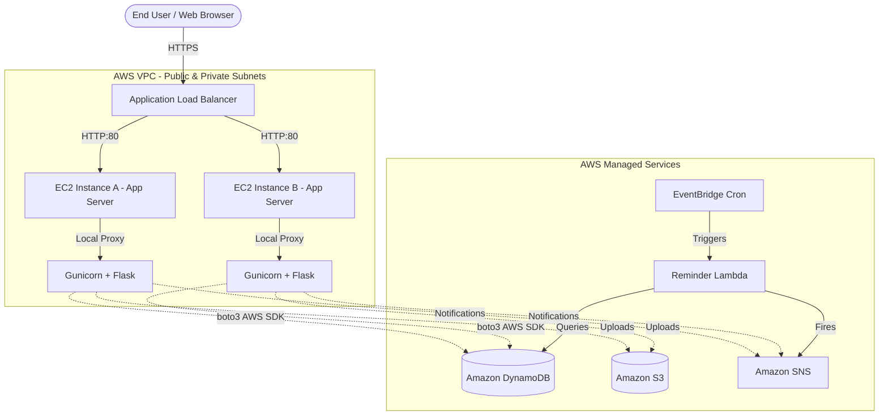

# MedTrack Architecture

MedTrack is built strictly using cloud-native patterns on AWS, designed to scale dynamically, prevent single points of failure, and heavily leverage managed services.

## System Diagram

## Service Breakdown

### 1. Compute Layer
- **Amazon EC2 (Amazon Linux 2023)**: Hosts the Flask web application. It runs behind an Nginx reverse proxy passing requests to a multi-worker Gunicorn server.
- **Auto Scaling & ALB**: The system is intended to sit behind an Application Load Balancer to distribute incoming HTTPS traffic, terminating SSL at the balancer.

### 2. Database Layer
- **Amazon DynamoDB**: Operates using On-Demand capacity provisioning. MedTrack employs 16 separated tables with highly optimized Global Secondary Indexes (GSIs).
- **Transactional Consistency**: To resolve race conditions common in healthcare scheduling, MedTrack utilizes `TransactWriteItems`. Booking a slot atomically writes a `SlotLock` conditional item ensuring zero double-bookings mathematically.

### 3. Object Storage Layer
- **Amazon S3**: Houses patient medical records and dynamically generated prescription PDFs.
- **Security**: The bucket is strictly private. EC2 instance profiles generate short-lived Presigned URLs, meaning users never have direct link access to PII.

### 4. Asynchronous Event Layer
- **Amazon SNS**: Used for sending OTP reset codes, registration approvals, and appointment alerts.
- **Amazon EventBridge + Lambda**: A serverless crontab executing daily at 08:00 AM UTC. A lightweight Lambda function scans upcoming appointments and triggers batch SNS dispatches for reminders without blocking the web servers.

### 5. Security & Identity
- **AWS IAM**: Strictly scoped JSON policies (provided in `/iam`) ensure that EC2 instances and Lambdas operate on the Principle of Least Privilege. 
- **AWS SSM Parameter Store**: Replaces `.env` files by securely injecting environment variables and database keys into the runtime at bootstrap.
